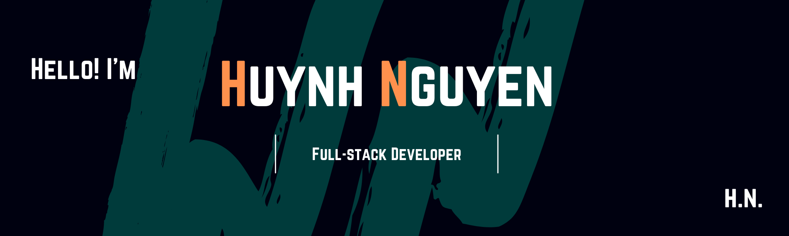

I am a full-stack developer with a strong interest in front-end development. I started my programming journey March, 2021. I enrolled and graduated as a full-stack developer in Java (Spring boot), Python (Django), and MERN stack. I am very lucky to have found my passion in programming in my early 30s. I have come a long way from zero knowledge to full-stack developer. Currently looking for opportunity in software development ultilizing 10 years experience in healthcare profession (pharmacy) and BA degree in Visual Art.

 ## 🔭 I’m currently working on:
 - Full-stack website for Echo Valley Family Farm (vegetable farm)
 - Website for an Adult Family Home 
 - Personal portfolio

<!-- ## 🌱I’m currently learning: -->
<!-- - ❤️  NextJS -->

## ⚙ Technologies I want to learn next:
- Angular
- Vue
- Refreshing my Python (Django) skill and get into Machine Learning
- And the list goes  on....😂

## ⚡ Fun fact: ...
- :tv: Friends and The Office are my all time favorite comedies
- :violin: I mostly enjoy instrumental music or soundtracks
- :grimacing: I enjoy playing games (not so much lately): Aion, Diablo series, League of Legends, WoW, Maplestory, Gunbound, Silkroad
- :poultry_leg: I cook 90% of my meals. Other 10% can be anything
- :muscle: I love working out. It has been a part of  my daily routine and healthy lifestyle
<!-- - 🤓 I really enjoy algorithm (improving my skills daily on this) -->

## 📫 How to reach me: ...
 ||
 [LinkedIn](https://www.linkedin.com/in/huynhtnguyen/ "Huynh's LinkedIn Profile")
 ||
  [Portfolio & Resume](https://huynhtn.com/ "Personal Portfolio & Resume")
<!--
- 🌱 I’m currently learning Python
- 👯 I’m looking to collaborate on React/Python
- 🤔 I’m looking for help with 
- 💬 Ask me about ...
- 📫 How to reach me: ...
- 😄 Pronouns: ...
- ⚡ Fun fact: ...
 -->

